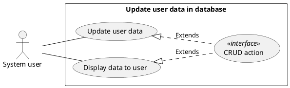
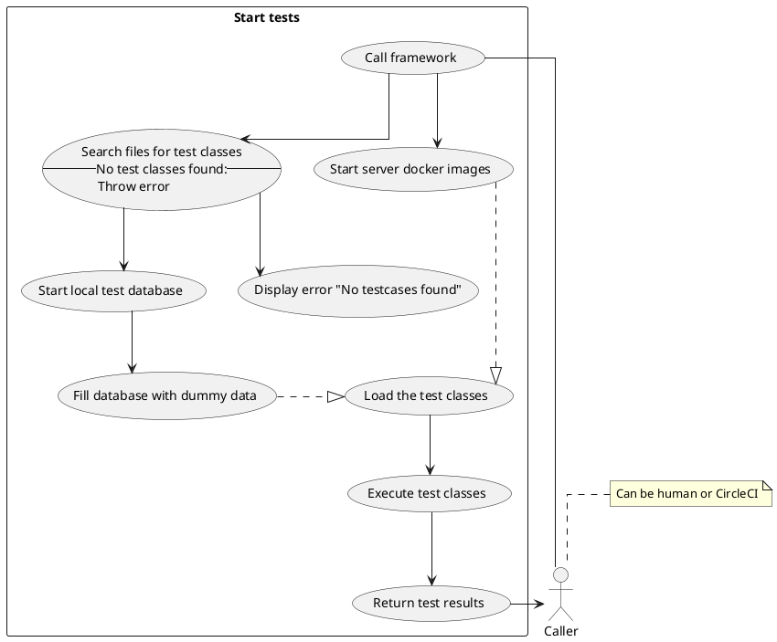
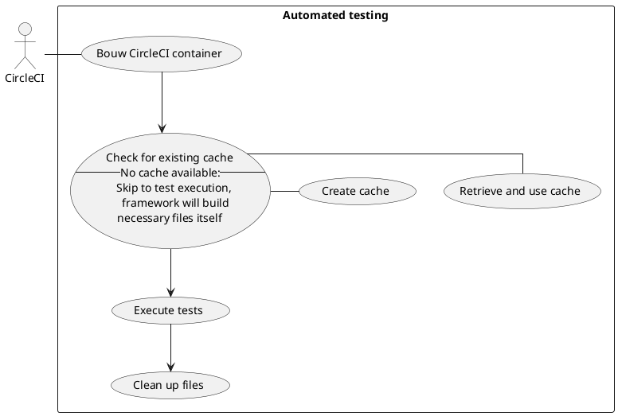
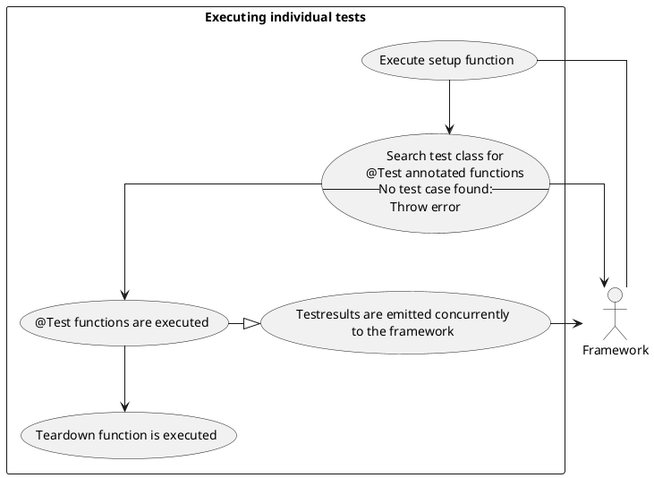
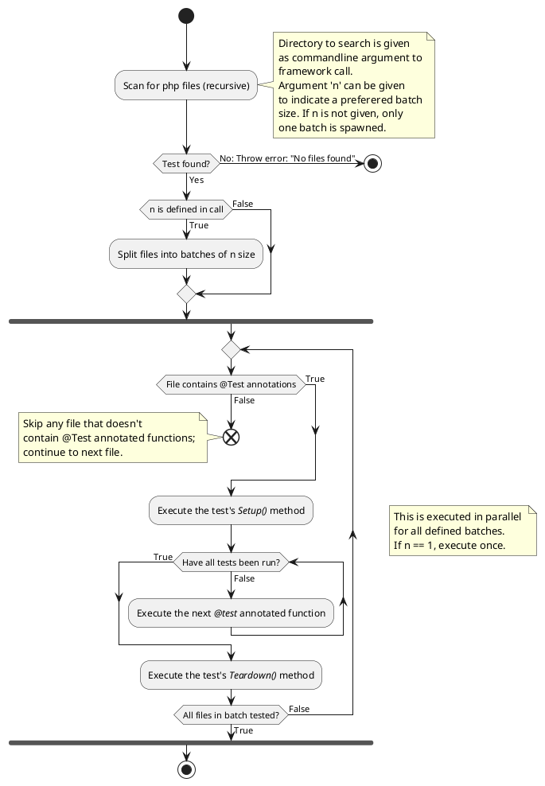
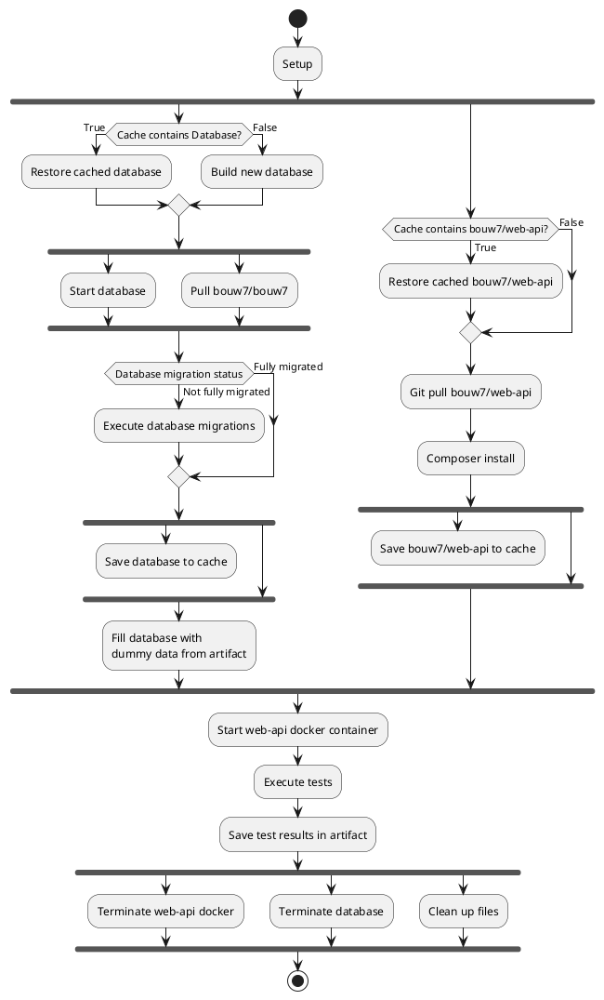
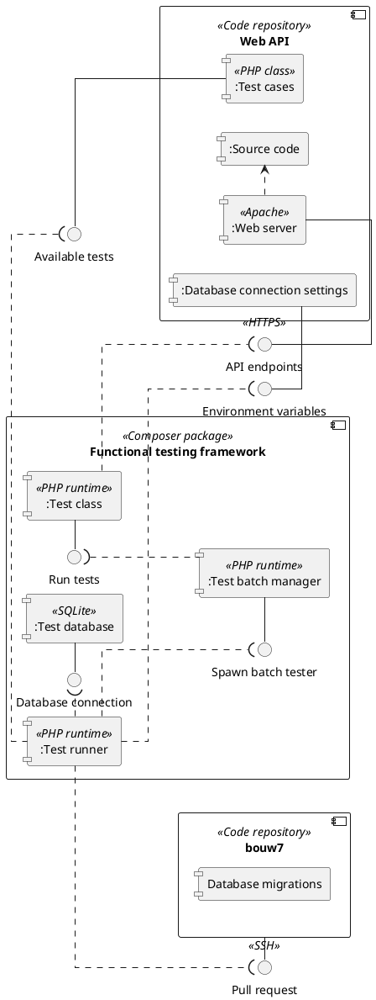
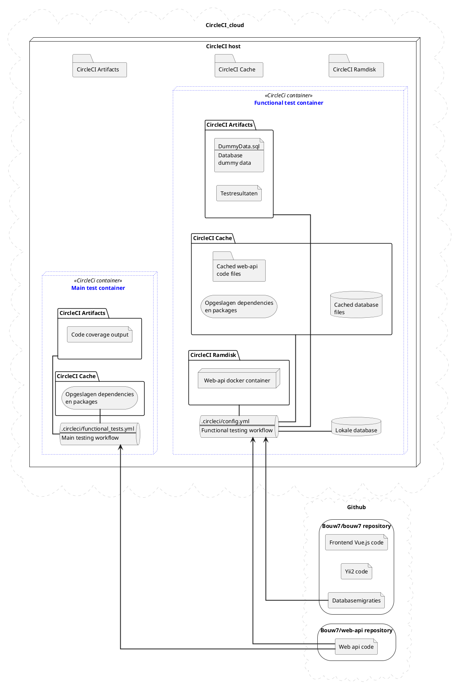
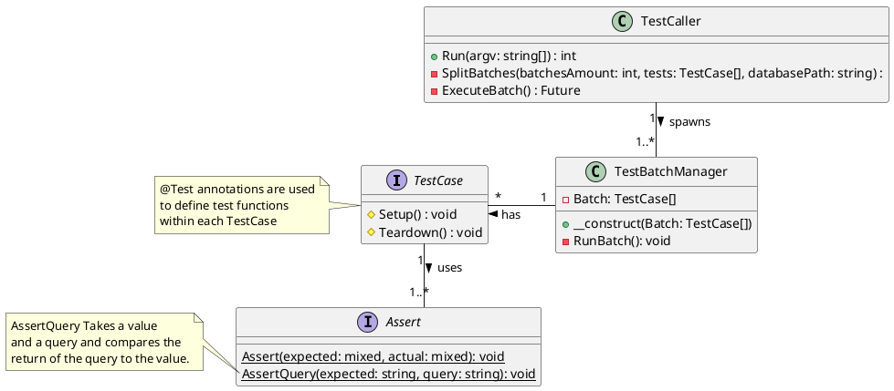

# Scenarios: Use cases
## Voorbeeld format
De use cases zullen op twee manieren gerepresenteerd worden; elke use case zal in de vorm van een tabel opgebouwd worden:
| Hier de titel             ||
|-|-|
| Actor             |   Hier de uitvoerende actor   |
| Precondities  	|   Hier de precondities	|
| Trigger       	|   Hier de trigger	|
| Postcondities 	|   Hier de postcondities	|
| Happy path      	|   Hier de happy path	|
| Alternatief       |   Hier een alternatief pad    |
| Notities      	|   Hier eventuelen notities	|  

Ook zullen de use cases in de vorm van UML diagrammen opgebouwd worden:

## Start tests
| Starten van de tests             ||
|-|-|
| Actor             |   Hier de uitvoerende actor   |
| Precondities  	|   De test case classes en de te testen code staan beschikbaar in de huidige directory	|
| Trigger       	|   Het test commando wordt uitgevoerd	|
| Postcondities 	|   De tests zijn uitgevoerd en de commando geeft een display weer met testresultaten	|
| Happy path      	|   1. Test commando wordt aangeroepen   2. Framework doorzoekt files op zoek naar tests  3. Framework start database  4. Framework vult database met dummy data  5. Apps worden opgestart met behulp van docker image webserver  6. Tests worden ingeladen  7. Test wordt uitgevoerd  8. Commando laat testresultaat zien 	|
| Alternatief       |   1. Test commando wordt aangeroepen  2. Framework kan geen tests vinden  3. Commando laat error bericht zien   |
| Notities      	|   Voor stap 7. "Test wordt uitgevoerd" van happy path, zie [Uitvoeren enkele test](#Uitvoeren-enkele-test)	|  

## Start automatisch testen
| Automatisch testen             ||
|-|-|
| Actor             |   CircleCI software   |
| Precondities  	|   De nieuwe code is naar de github repository gepushed	|
| Trigger       	|   Er is een taak gestart om de functionele tests door CircleCI uit te laten voeren	|
| Postcondities 	|   CircleCI reageert op de testresultaten	|
| Happy path      	|   1. CircleCI krijgt signaal om te starten met testen 2. CircleCI container wordt opgebouwd 3. Cache van eerdere tests wordt opgehaald 4. Tests worden uitgevoerd 5. Files worden opgeschoont 6. CirlceCI gaat verder met de volgende task	|
| Alternatief       |   1. CircleCI krijgt signaal om te starten met testen 2. CircleCI container wordt opgebouwd 3. Cache van eerdere tests is niet beschikbaar, deze zal niet gebruikt worden 4. Tests worden uitgevoerd 5. Files worden opgeschoont 6. Cache wordt opgeslagen 7. CirlceCI gaat verder met de volgende task   |
| Notities      	|   Voor stap 4. "Test worden uitgevoerd", zie [Start tests](#Start-tests)	|

## Uitvoeren enkele test
| Uitvoeren enkele test             ||
|-|-|
| Actor             |   Framework   |
| Precondities  	|   De omgeving is opgezet en de functionaliteit [Starten van tests](#start-tests) is doorlopen. Hierbij zijn de database en de backend web-api opgestelt en zijn alle huidige migraties op de database uitgevoerd. Ook is er een te testen test class bekend en meegegeven.	|
| Trigger       	|   Taak [Starten van tests](#start-tests) is afgerond en roept individuele tests aan.	|
| Postcondities 	|   De tests zullen uitgevoerd zijn en een resultaat terug hebben gegeven.	|
| Happy path      	|   1. Test class setup methode wordt uitgevoerd 2. Test class wordt doorzocht voor test functie annotaties 3. Tests worden uitgevoerd 4. Testresultaat wordt asynchroon aan de aanroeper doorgestuurd 5. Testclass teardown wordt uitgevoerd 6. Volgende test wordt gestart	|
| Alternatief       |   1. Test class setup methode wordt uitgevoerd 2. Test class wordt doorzocht voor test functie annotaties 3. Tests worden uitgevoerd 4. Test loopt tegen een onverwachte error aan 5. Geef error door aan aanroeper 6. Sla deze test over, ga door naar volgende test    |
| Notities      	|   Deze use case gaat ervanuit dat use case [Starten van tests](#start-tests) al uitgevoerd is.	|  

# Process view: Activity diagrams
## Executing tests

## CircleCI workflow

# Development view: Component diagram

# Physical view: Deployment diagram

# Logical view: Class diagram
