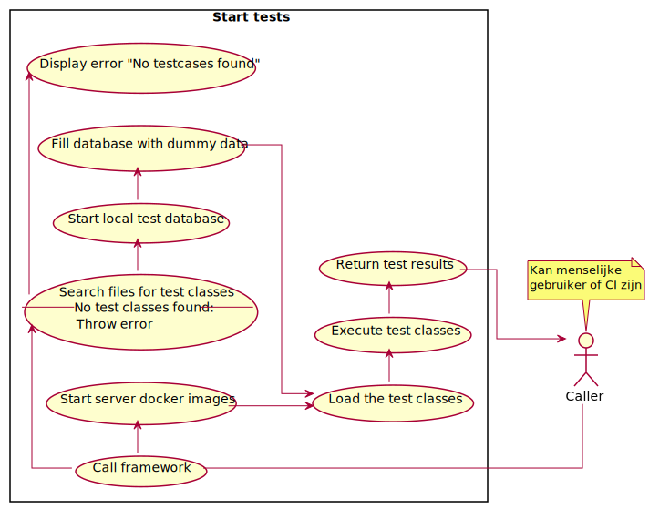

# Format
De use cases zullen op twee manieren gerepresenteerd worden; elke use case zal in de vorm van een tabel opgebouwd worden:
| Hier de titel             ||
|-|-|
| Actor             |   Hier de uitvoerende actor   |
| Precondities  	|   Hier de precondities	|
| Trigger       	|   Hier de trigger	|
| Postcondities 	|   Hier de postcondities	|
| Happy path      	|   Hier de happy path	|
| Alternatief       |   Hier een alternatief pad    |
| Notities      	|   Hier eventuelen notities	|  

Ook zullen de use cases in de vorm van UML diagrammen opgebouwd worden:

# Use cases
## Start test
| Starten van de tests             ||
|-|-|
| Actor             |   Hier de uitvoerende actor   |
| Precondities  	|   De test case classes en de te testen code staan beschikbaar in de huidige directory	|
| Trigger       	|   Het test commando wordt uitgevoerd	|
| Postcondities 	|   De tests zijn uitgevoerd en de commando geeft een display weer met testresultaten	|
| Happy path      	|   1. Test commando wordt aangeroepen   2. Framework doorzoekt files op zoek naar tests  3. Framework start database  4. Framework vult database met dummy data  5. Apps worden opgestart met behulp van docker image webserver  6. Tests worden ingeladen  7. Test wordt uitgevoerd  8. Commando laat testresultaat zien 	|
| Alternatief       |   1. Test commando wordt aangeroepen  2. Framework kan geen tests vinden  3. Commando laat error bericht zien   |
| Notities      	|   Voor stap 7. "Test wordt uitgevoerd" van happy path, zie [Uitvoeren tests](#Uitvoeren-Tests)	|  

## Start automatisch testen

## Uitvoeren tests